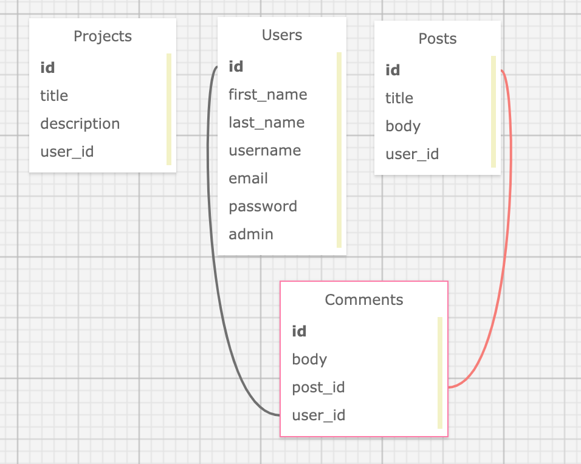

# _Portfolio Application_

_23 October 2020_

#### _Portfolio application for showcasing projects and posts_

#### By _**Vanessa Stewart**_

## Description

_This is a Friday project for Epicodus to practice authentication and authorization with Ruby on Rails. The original instructions include:_

Based on your work as a freelance developer for Mario's Speciality Food Products, you've been hired on at a local development agency. They have tasked you with your first project: building a basic content management system (or CMS). This CMS will be a basic portfolio site so that users can build their own portfolios.

It is fine if this is a site that is only for your portfolio, but you are also encouraged to explore making this project more abstract so that anyone could potentially use it. For that reason, specific values such as bios, projects and skills should not be hardcoded.

## User Stories
| #    | Story | 
| ---- | ----- | 
| 1 | As an admin, I should be able to log in and log out of the application. |  
| 2 | As an admin, I should be able to add, update, and delete projects. | 
| 3 | As an admin, I should be able to add, update, and delete posts. |
| 4 | As an admin, I should be able to add, update, and delete comments on posts. |
| 5 | As an admin, I want to ensure that other users don't have access to CRUD functionality. | 
| 6 | As an admin, I want to be able to delete comments by other users that are inappropriate. | 
| 7 | As a user, I want to be able to create an account and add a comment to a post. (A post can have many comments.) |
| 8 | As a user, I want to update or delete my own comments. Other users should not have this functionality unless they are admins. | 
| 9 | As an admin, I want to add pictures to my projects and posts. |
| 10 | As a user, I want to sort posts by oldest or newest. |
| 11 | As a user, I want to sort posts by most comments. |

## Data Tables Visualization

## Setup/Installation Requirements

To Extend Project:
1. Install Rails
- For this project, you will need Ruby. Follow the directions [here](https://www.learnhowtoprogram.com/ruby-and-rails/getting-started-with-ruby/ruby-installation-and-setup) for setting up Ruby.
- Install Rails on your machine with the following terminal command `gem install rails -v 5.2.0`

2. Clone Repo and Install Bundler
- Navigate to the directory on your local computer where you would like to clone this repo.
- Clone this repo using the `git clone` command in terminal/command line.
- Navigate to the cloned folder and run `gem install bundler` to install Bundler, which will mange all gem installations for our project.
- Run `bundle` or `bundle install` in your command line to download all dependencies. (If you add additional gems later, you will need to run `bundle update <gem name>`.)

3. Set Up Database
- Run `rake db:setup` in the terminal. This is akin to running the following rake tasks all at once: db:create(creates the dev and test databases for the current env), db:schema:load (recreates the database from the schema.rb file), and db:seed(runs the db/seed.rb file).

4. Open in Text Editor
- Open the cloned repo in a text editor of your choice.
- To Run Tests: While in the root directory of this project, run `rspec` in your command line. If this command gives you trouble, try using `bundle exec rspec` instead.
- To Run the App in Browser: While in the root directory of the project, run `rails s` in the terminal. This will start a server, which you can access by entering `localhost:3000` in your browser.

5. To Set a New Admin User
- Run `rails c` in terminal to open up Rails console.
- Run `User.all` to see all users in database.
- Find the correct one and save in variable. (Ex. `user = User.all.first`)
- Set user variable's admin value to true. (Ex. `user.admin = true`)
- Save user (Ex. `user.save`)
- Leave the conosle by running `exit`.

## Known Bugs

_There are no known bugs at this time._

## Items to Improve

* Though testing was not the goal of this project, it would be good form to add integration tests
* Refactor controllers
* Make devise user flash messages white for readability

## Support and Contact Details

_Connect with me at vamariestewart@gmail.com with ideas to improve this project._

## Technologies Used

* HTML
* CSS/Bootstrap
* Ruby
* Ruby on Rails
* Postgres
* Added Ruby Gems: Capybara, Devise, jQuery-Rails, Launchy, Pry, RSpec-Rails, Shoulda-Matchers, SimpleCov

## Photo Credits
Home page photo by <a href="https://unsplash.com/@retrosupply?utm_source=unsplash&amp;utm_medium=referral&amp;utm_content=creditCopyText">RetroSupply</a> on <a href="https://unsplash.com/s/photos/portfolio?utm_source=unsplash&amp;utm_medium=referral&amp;utm_content=creditCopyText">Unsplash</a>

Projects/Posts page photo by <a href="https://unsplash.com/@jesuskiteque?utm_source=unsplash&amp;utm_medium=referral&amp;utm_content=creditCopyText">Jesus Kiteque</a> on <a href="https://unsplash.com/?utm_source=unsplash&amp;utm_medium=referral&amp;utm_content=creditCopyText">Unsplash</a>

Projects/Posts page photo by <a href="https://unsplash.com/@anete_lusina?utm_source=unsplash&amp;utm_medium=referral&amp;utm_content=creditCopyText">Anete Lūsiņa</a> on <a href="https://unsplash.com/s/photos/portfolio?utm_source=unsplash&amp;utm_medium=referral&amp;utm_content=creditCopyText">Unsplash</a>

Projects/Posts photo by <a href="https://unsplash.com/@otenteko?utm_source=unsplash&amp;utm_medium=referral&amp;utm_content=creditCopyText">Anas Alshanti</a> on <a href="https://unsplash.com/s/photos/portfolio?utm_source=unsplash&amp;utm_medium=referral&amp;utm_content=creditCopyText">Unsplash</a>

Projects/posts photo by <a href="https://unsplash.com/@lum3n?utm_source=unsplash&amp;utm_medium=referral&amp;utm_content=creditCopyText">LUM3N</a> on <a href="https://unsplash.com/s/photos/portfolio?utm_source=unsplash&amp;utm_medium=referral&amp;utm_content=creditCopyText">Unsplash</a>

### License

Copyright (c) 2020 **_Vanessa Stewart_**

Permission is hereby granted, free of charge, to any person obtaining a copy of this software and associated documentation files (the "Software"), to deal in the Software without restriction, including without limitation the rights to use, copy, modify, merge, publish, distribute, sublicense, and/or sell copies of the Software, and to permit persons to whom the Software is furnished to do so, subject to the following conditions:

The above copyright notice and this permission notice shall be included in all copies or substantial portions of the Software.

THE SOFTWARE IS PROVIDED "AS IS", WITHOUT WARRANTY OF ANY KIND, EXPRESS OR IMPLIED, INCLUDING BUT NOT LIMITED TO THE WARRANTIES OF MERCHANTABILITY, FITNESS FOR A PARTICULAR PURPOSE AND NONINFRINGEMENT. IN NO EVENT SHALL THE AUTHORS OR COPYRIGHT HOLDERS BE LIABLE FOR ANY CLAIM, DAMAGES OR OTHER LIABILITY, WHETHER IN AN ACTION OF CONTRACT, TORT OR OTHERWISE, ARISING FROM, OUT OF OR IN CONNECTION WITH THE SOFTWARE OR THE USE OR OTHER DEALINGS IN THE SOFTWARE.